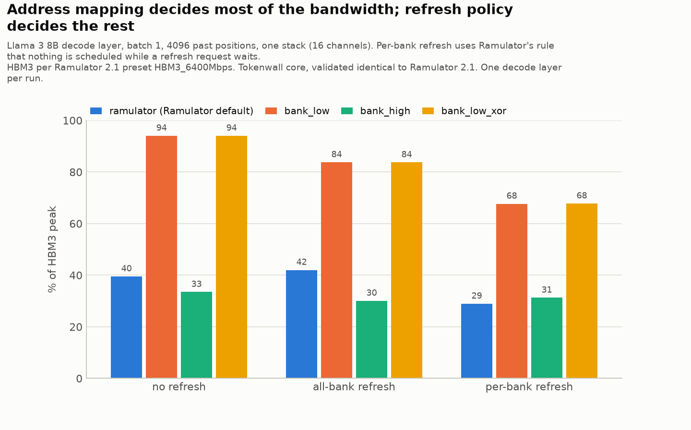
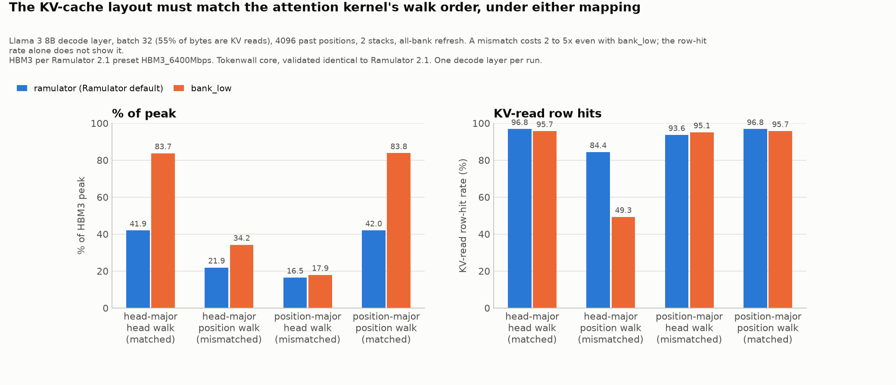
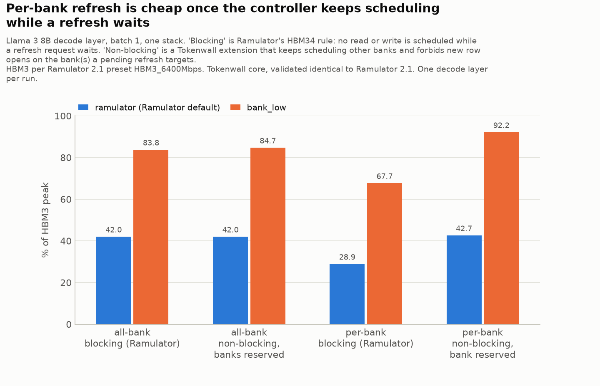

# Tokenwall

**An HBM3 timing model driven by LLM decode traces.**

When a large language model generates one token in decode mode, the GPU streams
every weight matrix and the whole KV cache out of memory while doing very little
arithmetic per byte. The token rate is set by memory, not math. HBM3 quotes a
peak bandwidth, but real address streams never get all of it: rows must be
opened and closed, banks have timing rules measured in nanoseconds, and refresh
takes banks offline. Tokenwall answers one question with a simulator:

> For the exact address stream of one decode step, what fraction of HBM3 peak
> bandwidth is achieved, and which timing rules ate the rest?

## Three pieces

1. **Trace generator (Python, done).** Turns a model shape (layers, hidden
   size, heads, KV heads, dtype, batch, past positions) into the ordered stream
   of 32-byte memory requests one decode step issues on one GPU. No GPU needed:
   the pattern is deterministic from the model's shape. KV-cache layout and
   issue order are knobs because they change row locality.
2. **Address mapping + timing core (done), Python + C++.** A swappable bit-slice
   mapping from linear address to (channel, pseudo channel, SID, bank group,
   bank, row, column) with four policies, then a C++ model of HBM3 channels:
   a hierarchical timing tree enforcing all 51 of Ramulator's HBM3 rules
   (tRCD, tRP, tRAS, tRC, tCCD_S/L/R, tRRD_S/L, tFAW, turnarounds, tPPD,
   tREFI/tRFC, command-bus occupancy) in half-clock ticks, a bank state
   machine, and an FR-FCFS controller with HBM3's split command bus. Reports
   cycles, achieved bandwidth, row-buffer hit rate, and attributes every idle
   column-command slot to the named rule that blocked the oldest request.
3. **Sweep (Python, Phase 5).** Varies mapping, KV layout, refresh policy, batch
   size and sequence length; plots what actually matters.

[Ramulator 2.1](https://github.com/CMU-SAFARI/ramulator2) is the reference:
it supplies the HBM3 timing parameters (`configs/hbm3/`) and, in Phase 4, the
ground truth the C++ core is validated against.

## Status

| Phase | Scope | State |
|------:|-------|-------|
| 0 | Repo, build system, Ramulator 2.1 built and run, HBM3 parameters extracted | done 2026-09-30 |
| 1 | Decode-step trace generator, Llama 3 8B/70B configs, Python/C++ cross-checked trace format | done 2026-09-30 |
| 2 | Four address-mapping policies, bit-exact with Ramulator's default, Python/C++ mirrored, measured on real traffic | done 2026-09-30 |
| 3 | C++ timing core: timing tree, bank state machine, HBM3 controller, stall attribution; cycle-exact with Ramulator on first run | done 2026-09-30 |
| 4 | Validation against Ramulator 2.1: writes, per-bank refresh, interleaves, 32 channels, KV-heavy and 70B slices, command-level diff; 30 cases identical | done 2026-09-30 |
| 5 | Sweeps: mapping, refresh, batch, context, KV layout, GQA, 70B, rule ablation, controller experiment; 92 runs, 7 plots | done 2026-10-01 |
| 6 | Writeup | next |

`PROGRESS.md` is the session log with open design questions. `RESULTS.md` has
every measured number, the command that produced it, and the date. Nothing in
`RESULTS.md` is estimated or typed by hand.

## Provenance rules (read before quoting any number)

- **HBM3 timings are "per Ramulator 2.1's `HBM3_6400Mbps` preset", never "per
  JEDEC".** Thirteen core timings in that preset (tCL, tCWL, tFAW, tRAS,
  tRCDRD, tRCDWR, tRP, tRRD_L, tRRD_S, tRTP, tWR, tWTR_L, tWTR_S) sit inside a
  block Ramulator's source labels `Ramulator Guesstimate`; JEDEC JESD238 leaves
  them to vendor datasheets. Every timing in `configs/hbm3/*.yaml` carries a
  `source` tag saying whether it is a speed-bin value, an estimate, a derived
  formula, or a user override. Plot captions and RESULTS entries repeat this.
- **Model shapes come from published `config.json` files**, fetched by
  `scripts/import_hf_config.py`, which records the URL that answered, the
  SHA-256 of the bytes, and keeps the raw file under `configs/models/raw/`.
  The official Meta repos are gated (HTTP 401); the NousResearch mirrors
  served identical files, and the record says so.
- **Phase 0 and Phase 1 bandwidth figures are toolchain checks** on synthetic
  traffic or a single channel. Project findings start with Phase 4.

### Swapping in real vendor timings

A memory architect's first question is "what if tRCD is really X?". The
override path is one flag per timing, in clock cycles, and the output file is
forced to carry a distinct name so it cannot be mistaken for the preset:

```bash
python scripts/extract_hbm3_params.py --override nRCDRD=28 --override nRP=24 --name vendor_x
# -> configs/hbm3/hbm3_16gb_8hi_6400_vendor_x.yaml, overridden keys tagged "override: user-supplied"
```

Ramulator applies overrides after it computes derived timings, so nRC, nRTW,
nREFIpb and friends are not recomputed from an overridden input; override them
too when a datasheet changes their inputs (the YAML's `override_note` repeats
this). The same keyword overrides work directly in Ramulator:
`ramulator.dram.HBM3(org_preset=..., timing_preset=..., nRCDRD=28)`.

## Models and why one shard is the honest unit

Two shapes, `configs/models/llama3_8b.yaml` and `llama3_70b.yaml`. There is no
third model: `--n-kv-heads 32` on the 8B config gives full multi-head attention
so the GQA effect on KV traffic shows up in isolation, without confounding it
against a different layer count and hidden size.

A single HBM3 stack holds 16 GiB, and Llama 3 70B in bf16 is 131 GiB. Real 70B
serving shards the model across 8 GPUs with tensor parallelism, so a single
GPU's HBM genuinely holds about an eighth of the weights plus its share of the
KV cache. That is the actual deployment shape, not a workaround: Tokenwall
simulates **one tensor-parallel shard** (`--tp 8` for 70B, `--tp 1` for 8B) on
a GPU with `--stacks` HBM3 stacks (an H100 has five). The generator refuses a
run whose footprint does not fit and names the stack count that would.

## Trace format: a recipe, not a list

One decode step of Llama 3 8B is 486 million 32-byte requests; a plain list is
tens of gigabytes. Tokenwall stores a *segment list* instead: "start at base,
read run_bytes, repeat runs times with this stride", grouped so that a group
can either play its segments in order or round-robin chunks between them
(many streams hitting memory at once). Both `python/tokenwall/segments.py` and
`cpp/include/tokenwall/segments.h` expand the same file to the same request
sequence, and `tests/test_cross_expander.py` hashes both streams and compares
them line by line, so the two implementations cannot drift silently. A full
8B step expands in 1.2 s in C++ and has a stable fingerprint
(`RESULTS.md`, "Stream fingerprint").

## Findings (Phase 5)

Every figure: HBM3 per Ramulator 2.1's preset, Tokenwall core validated
identical to Ramulator 2.1, one decode layer per run. Details and the honest
caveats are in `docs/phase5_findings.md`; every number is in `RESULTS.md`.

1. **Address mapping is the first-order knob.** Ramulator's default mapping
   reaches 42% of peak on a Llama 3 8B decode step; a bank-group-interleaved
   mapping reaches 84%, 45 ms versus 23 ms per token on one stack against a
   19 ms floor. XOR hashing adds nothing; the bank-bits-high anti-pattern
   gets 30%.

   

2. **Batch size, context length, GQA versus MHA and 8B versus 70B do not move
   the fraction of peak**; they move bytes per step. KV reads under a matched
   layout are long sequential runs like weight sweeps. (`batch_seq.png`,
   `gqa_70b.png`)

3. **The KV-cache layout must match the attention kernel's walk order, under
   either mapping.** A mismatch costs 2 to 5x while the row-hit rate stays
   above 95%: one head's stream lands on a quarter of the channels. Phase 2's
   static analysis missed this; timing simulation did not.

   

4. **Refresh cost is a controller decision.** All-bank refresh costs 10 points
   under `bank_low`. Per-bank refresh costs 26 points under Ramulator's rule
   that nothing is scheduled while a refresh waits, and 2 points once the
   controller keeps scheduling other banks and reserves the target bank. The
   first non-blocking attempt starved refresh (longest postponement 567 µs);
   measuring postponement caught it.

   

5. **Rule ablation ranks the losses.** Under the default mapping tCCD_L alone
   is 15 points, tRCD 4, tRP 3; under `bank_low` the leftovers are tCCD_R
   (2.4), tRP (1.5) and tFAW (1.3). Write turnarounds cost nothing on decode
   traffic. (`ablation.png`, `attribution.png`)

## Address mapping: which bits pick the bank

An address is a big binary number, and a mapping policy says which of its bits
pick the channel, which pick the bank, and which pick the row. Put the bank bits
low and consecutive accesses spread across banks like cards dealt around a
table; put them high and they pile onto one bank. Four policies live in
`python/tokenwall/addrmap.py`, mirrored in `cpp/include/tokenwall/addrmap.h`:

| Policy | Bit order (low to high, above the 32 B line) | What a streaming sweep does |
|---|---|---|
| `ramulator` | channel, column, pseudo channel, SID, bank group, bank, row | one 1 KiB row of one bank at a time; back-to-back reads share a bank group and pay tCCD_L |
| `bank_low` | channel, pseudo channel, bank group, bank, SID, column, row | alternates bank groups every access (tCCD_S pace), keeps every bank open |
| `bank_high` | channel, column, pseudo channel, row, SID, bank group, bank | walks all rows of one bank before touching another; the anti-pattern |
| `bank_low_xor` | `bank_low` with low row bits XORed into the bank bits | breaks power-of-two strides that would alias onto one bank |

`ramulator` reproduces Ramulator 2.1's `CacheLineInterleave` + `RoBaRaCoCh`
bit for bit: `tests/test_addrmap.py` checks it against a transcription of the
C++, and `scripts/ramulator2_mapping_check.py` feeds Ramulator the same traffic
flat and pre-mapped and gets identical statistics. Every policy takes a channel
interleave granularity (32 B to 1 KiB). `python -m tokenwall map --policy X`
prints the bit layout and how often each field changes; `python -m tokenwall
locality` reports ideal row-hit rate and bank spread for a trace under a
policy before any timing is simulated. Measured bandwidth per policy is in
`RESULTS.md` (Phase 2).

## Timing core: promises per desk

A bank is a desk with one open book. For every desk, and for the bank group,
die and pseudo channel above it, the core keeps promises of the form "no new
book before tick 142", "no read before tick 63". A command is legal when every
promise on its path has expired; issuing it writes new promises. The controller
is the librarian who each tick picks the oldest request whose next command is
legal (first-ready, first-come-first-served), with HBM3's quirks: column
commands only on rising clock edges, one row command per tick, a precharge
may use a falling edge.

The rule table is not typed by hand: `scripts/export_dram_spec.py` dumps the
tables Ramulator 2.1 itself resolves at run time (latencies in half-CK ticks
with command-length adjustments, 60 entries) into
`configs/hbm3/hbm3_16gb_8hi_6400.spec`, which the C++ loads. Each rule has a
unit test with a hand-derived expected tick (`cpp/tests/test_timing.cpp`),
and `cpp/tests/test_controller.cpp` checks command-by-command timelines.

**Validation.** `scripts/tokenwall_vs_ramulator.py` feeds the same traffic to
both simulators. Across 30 cases (four mappings, three refresh modes, three
channel interleaves, 16 and 32 channels, writes included, an 8B layer, a
KV-heavy batch-32 slice and a 70B tensor-parallel slice) every integer
statistic is identical: ticks, served requests, hits, misses, conflicts
(`RESULTS.md`, Phases 3 and 4). With `--cmd-trace` both simulators log every
DRAM command and `scripts/cmd_trace_diff.py` reports the first divergence
with per-bank context; on a 2 M-request slice all 2,081,313 commands match,
and removing one rule on purpose makes the tool point at the exact command.
This validates the implementation against Ramulator, whose algorithms it
deliberately mirrors; it is not an independent model of HBM3 silicon, and
the timings remain Ramulator's preset.

**What Ramulator does not report.** Every rising edge is a column-command
slot per pseudo channel. Tokenwall labels each slot `data` (a burst is on the
wires), `empty` (nothing queued), `arbitration` (ready but lost the bus), or
the command and rule that blocked the oldest request, e.g.
`RD:BankGroup:nCCDL`, `ACT:PseudoChannel:nRFC`. `--disable nFAW` removes a
rule for ablation; `--refresh perbank` selects per-bank refresh;
`--refresh-nonblocking` keeps scheduling other banks while a refresh waits
(with the target bank reserved); every run reports the longest refresh
postponement so a refresh-starving configuration cannot pass unnoticed.

```bash
./build/cpp/tokenwall sim --segs traces/llama3_8b_tp1_b1_s4096.segs --policy bank_low --stacks 1 --refresh allbank --drain --json out.json
./build/cpp/tokenwall sim --segs ... --refresh perbank --cmd-trace cmds.csv       # per-bank refresh, log every command
python scripts/tokenwall_vs_ramulator.py --trace layer0_b1 --requests 2000000 --policies all --refresh none,allbank,perbank
python scripts/tokenwall_vs_ramulator.py --trace 70b_layer0 --requests 10000000 --cmd-trace   # with command-level diff
```

## Layout

```
cpp/                 C++: trace format + expander, address mapping, DRAM spec, timing tree, controller, `tokenwall sim`, unit tests
python/tokenwall/    trace generator, address mapping (addrmap.py), locality analysis, CLI (python -m tokenwall)
configs/hbm3/        HBM3 parameters extracted from Ramulator 2.1, with provenance
configs/models/      Llama 3 shapes imported from published config.json, raw files under raw/
tests/               pytest suite incl. the Python-vs-C++ cross-expander check
scripts/             setup_ramulator2.sh, extract_hbm3_params.py, import_hf_config.py, Ramulator runners
patches/ramulator2/  two-hunk build fix for Apple Clang
docs/                phase walkthroughs written for study
results/             raw outputs behind every number in RESULTS.md
traces/              generated traces (.segs gitignored, .meta.json committed)
external/ramulator2  Ramulator 2.1 git submodule (pinned commit)
```

## Setup (macOS or Linux laptop, no paid tools)

Requirements: git, CMake 3.16+, a C++20 compiler, Python 3.10+.

```bash
git clone --recursive <this repo> tokenwall && cd tokenwall
python3 -m venv .venv && .venv/bin/pip install -r requirements.txt && .venv/bin/pip install -e .
scripts/setup_ramulator2.sh        # builds Ramulator 2.1 into external/, pip-installs it into .venv
cmake -S . -B build && cmake --build build && ctest --test-dir build   # Tokenwall C++
.venv/bin/python -m pytest -q      # 94 Python tests; ctest runs 35 C++ cases (17 timing rules, 8 controller timelines)
```

`scripts/setup_ramulator2.sh` applies the patches in `patches/ramulator2/`:
`0001` fixes two Apple Clang 21 build errors (a missing `template` keyword,
`fmt` 10.2.1 to 11.2.0) and touches no simulation behaviour; `0002` lets
Ramulator's pre-mapped `ReadWriteTrace` carry an optional flat address so its
write coalescing and read forwarding work on pre-mapped traces.

## Reproduce

Phase 0 (HBM3 parameters and toolchain checks):

```bash
source .venv/bin/activate
python scripts/extract_hbm3_params.py        # -> configs/hbm3/hbm3_16gb_8hi_6400.yaml
python scripts/ramulator2_hbm3_smoke.py      # synthetic sequential/random reads on one channel
python scripts/ramulator2_probe_demo.py      # asks the device model when commands become legal
```

Phase 1 (decode-step traces):

```bash
python scripts/import_hf_config.py --repo meta-llama/Meta-Llama-3-8B --mirror NousResearch/Meta-Llama-3-8B --name llama3_8b
python -m tokenwall gen --model configs/models/llama3_8b.yaml --batch 1 --seq 4096 --out traces/llama3_8b_tp1_b1_s4096
./build/cpp/tw_expand traces/llama3_8b_tp1_b1_s4096.segs             # count + fingerprint hash
python -m tokenwall gen --model configs/models/llama3_70b.yaml --tp 8 --stacks 2 --batch 1 --seq 4096 --out traces/llama3_70b_tp8_b1_s4096
python -m tokenwall gen --model configs/models/llama3_8b.yaml --n-kv-heads 32 --stacks 2 --batch 1 --seq 4096 --out traces/llama3_8b_mha32_tp1_b1_s4096
python -m tokenwall export-ramulator traces/llama3_8b_tp1_b1_s4096.segs --out traces/slice.txt --max-requests 1000000
```

Phase 5 (sweeps, about 10 minutes, plus optional full-step anchors of 7 to 35 minutes each):

```bash
python scripts/sweep.py --sweeps all --workers 6
python scripts/plot_sweeps.py                                    # results/phase5/plots/*.png
./build/cpp/tokenwall sim --segs traces/llama3_8b_tp1_b1_s4096.segs --policy bank_low --stacks 1 --refresh perbank --refresh-nonblocking --drain
```

Phase 4 (validation matrix, about 15 minutes in total):

```bash
python scripts/tokenwall_vs_ramulator.py --trace layer0_b1 --requests 2000000 --policies all --refresh none,allbank,perbank
python scripts/tokenwall_vs_ramulator.py --trace layer0_b1 --requests 2000000 --policies ramulator --refresh allbank --cmd-trace --disable nCCDL --label inject
python scripts/tokenwall_vs_ramulator.py --trace layer0_b32 --requests 40000000 --policies ramulator,bank_low --refresh allbank
```

Phase 3 (timing core):

```bash
ctest --test-dir build --output-on-failure                 # 34 C++ cases
python scripts/export_dram_spec.py                         # regenerate the rule table from Ramulator
python scripts/tokenwall_vs_ramulator.py                   # Tokenwall vs Ramulator, 4 cases, identical expected
```

Phase 2 (mapping policies):

```bash
python -m tokenwall map --policy bank_low --stacks 1                  # bit layout and field periods
python -m tokenwall locality traces/llama3_8b_tp1_b1_s4096.segs --policy bank_low --stacks 1
python scripts/ramulator2_mapping_check.py                            # bit-exactness + 4 policies under Ramulator timing
./build/cpp/tw_expand traces/x.segs --map bank_low --stacks 1 --ramulator-out x.txt   # pre-mapped export from C++
```

`python -m tokenwall gen --help` lists every knob: `--kv-layout`, `--kv-order`,
`--weight-streams`, `--chunk-bytes`, `--kv-chunk-bytes`, `--layers a:b`,
`--request-bytes`, `--stacks`, `--tp`, `--n-kv-heads`, `--dtype-bytes`.
`docs/phase1_trace_generator.md` explains what each one models.
